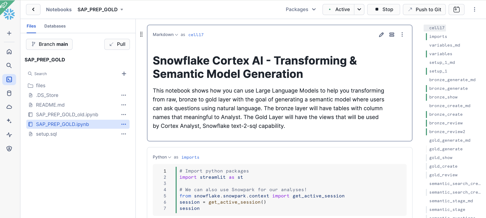
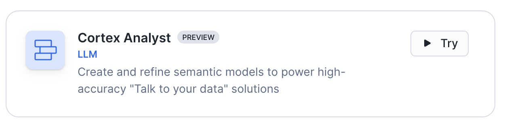
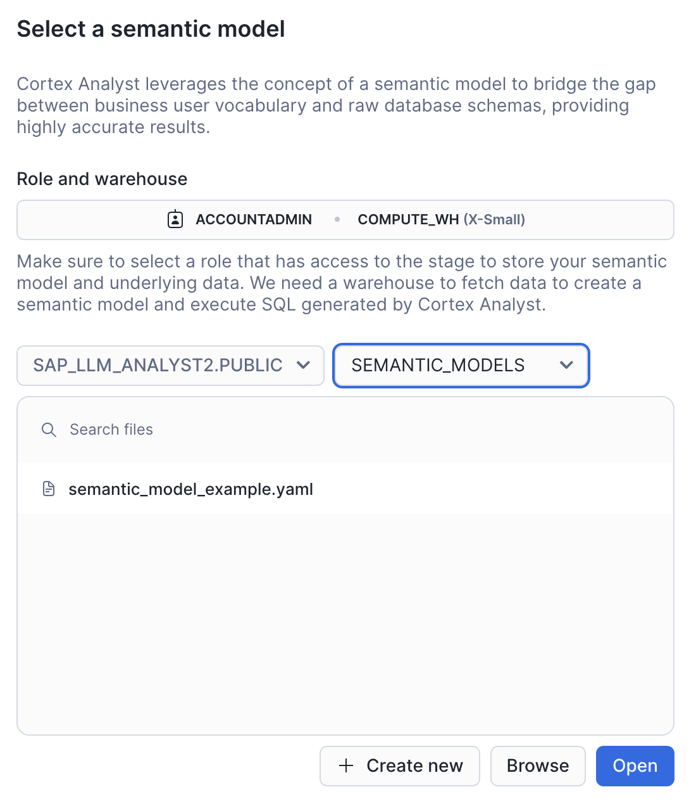
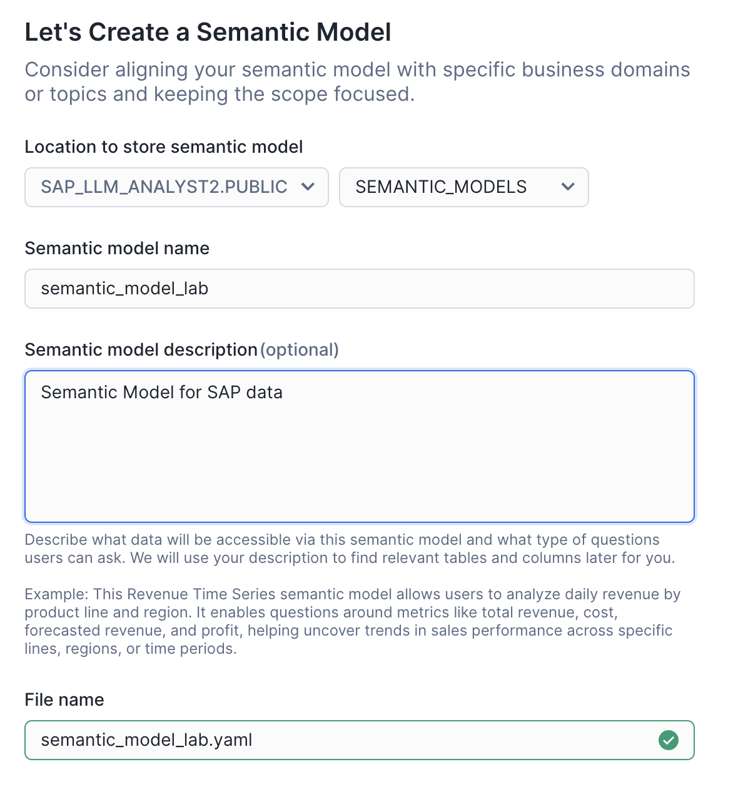
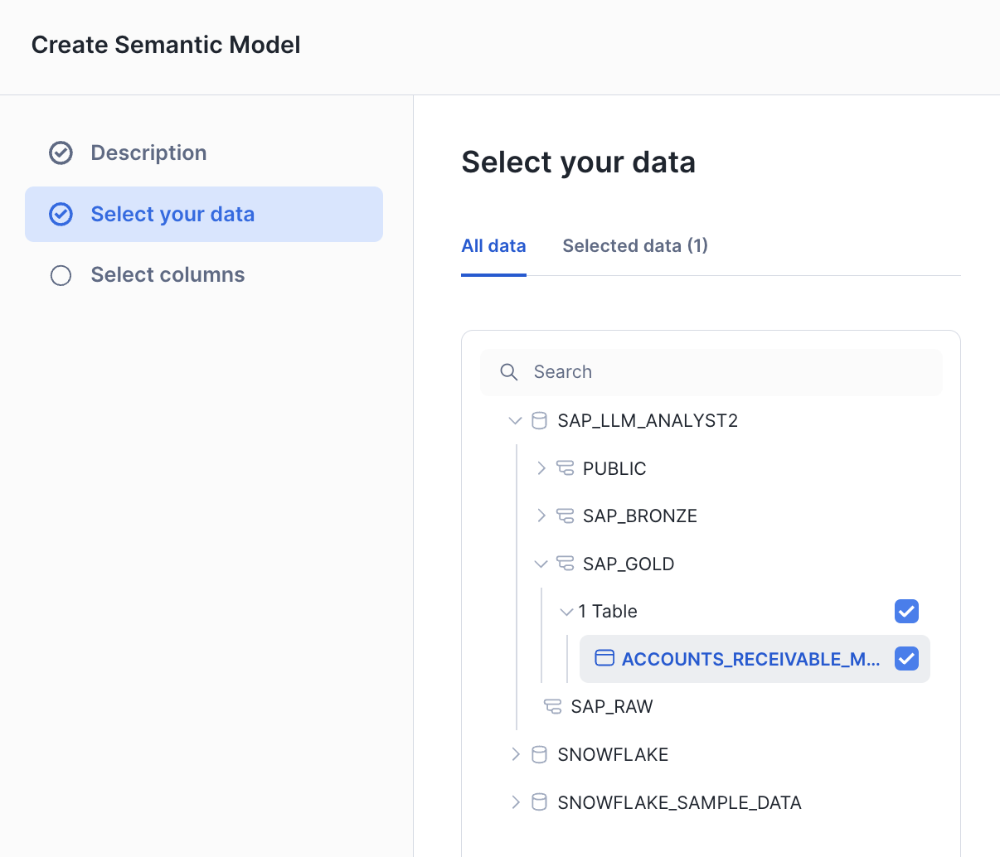
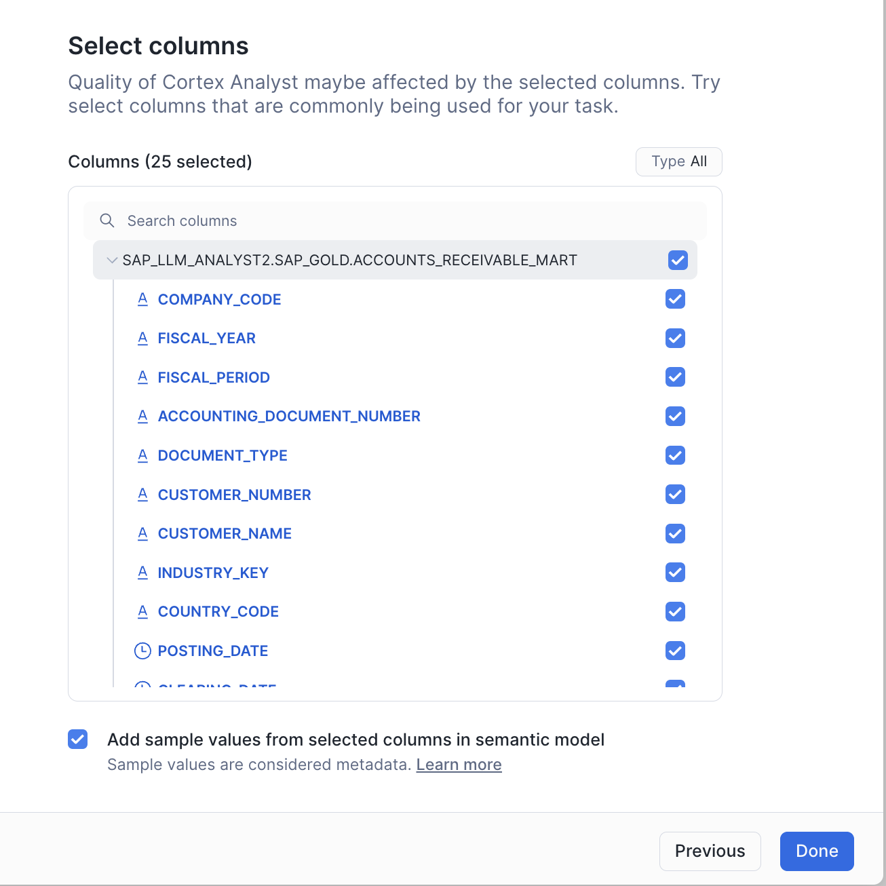
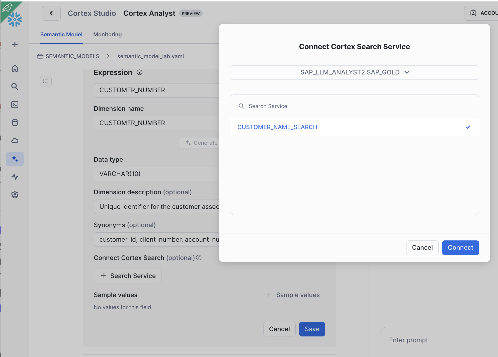

# SAP LLM ANALYST DEMO

1. Copy/Past and run all these in a Snowflake Worksheet. This will setup the git connection, fetch the repository
and will run the setup.sql script to setup the RAW layer. It will also creat the Notebook to be run

```sql

CREATE or replace DATABASE SAP_LLM_ANALYST2;

CREATE OR REPLACE API INTEGRATION API_GITHUB_REPO_SAP_LLM_ANALYST
  API_PROVIDER = git_https_api
  API_ALLOWED_PREFIXES = ('https://github.com/ccarrero-sf/')
  ENABLED = TRUE;

CREATE OR REPLACE GIT REPOSITORY GITHUB_REPO_SAP_LLM_ANALYST
    api_integration = API_GITHUB_REPO_SAP_LLM_ANALYST
    origin = 'https://github.com/ccarrero-sf/sap_llm_analyst';

-- Make sure we get the latest files
ALTER GIT REPOSITORY GITHUB_REPO_SAP_LLM_ANALYST FETCH;

SELECT SYSTEM$BEHAVIOR_CHANGE_BUNDLE_STATUS('2024_08');
-- ENABLE LATEST PYTHON VERSIONS
SELECT SYSTEM$ENABLE_BEHAVIOR_CHANGE_BUNDLE('2024_08');
-- Check it is enabled
SELECT SYSTEM$BEHAVIOR_CHANGE_BUNDLE_STATUS('2024_08');

-- enable cross-region inference if you wish to use a model which is not available in your region
ALTER ACCOUNT SET CORTEX_ENABLED_CROSS_REGION = 'ANY_REGION';

-- Create RAW layer automation
EXECUTE IMMEDIATE FROM @SAP_LLM_ANALYST2.PUBLIC.GITHUB_REPO_SAP_LLM_ANALYST/branches/main/setup.sql;

-- Copy the Notebook to be used

CREATE OR REPLACE NOTEBOOK SAP_PREP_GOLD
    FROM '@SAP_LLM_ANALYST2.PUBLIC.GITHUB_REPO_SAP_LLM_ANALYST/branches/main/' 
        MAIN_FILE = 'SAP_PREP_GOLD.ipynb' 
        QUERY_WAREHOUSE = COMPUTE_WH;

ALTER NOTEBOOK SAP_PREP_GOLD ADD LIVE VERSION FROM LAST;

```

2. Open the SAP_PREP_GOLD notebook and execute each cell. You can verify the output of each one.




3. Open Semantic Model Generator to create a semantic file to be used with Cortex Analyst.

Under Snowflake AI & ML Studio open Cortex Analyst:



Select your database, the PUBLIC schema and the SEMANTIC_MODELS staging area that we had created. You have one example there, but let's create our own semantic model.



Give it a name and describe it if you want



Select the table under RAW_GOLD schema:



Add all columns:



This will create your first semantic model that you can inspect and edit to add your own terminology.

Now we are going to use Cortex Search to improve Cortex Analyst results. In the previous notebook, we had executed this SQL to create a Cortex Search service on the CUSTOMER_NAME. 

```sql
CREATE OR REPLACE CORTEX SEARCH SERVICE {GOLD_LAYER}.CUSTOMER_NAME_SEARCH 
ON CUSTOMER_NAME 
WAREHOUSE = COMPUTE_WH  
TARGET_LAG = '1 day' 
EMBEDDING_MODEL = 'snowflake-arctic-embed-l-v2.0' 
AS (SELECT DISTINCT CUSTOMER_NAME FROM {GOLD_LAYER}.accounts_receivable_mart);
```

Find CUSTOMER_NAME column in your semantic model. Remove the sample values (as they will be taken from Cortex Search) and connect with the Cortex Search service we had created (under SAP_GOLD schema):



Now you can test your semantic model. Start asking questions!

- What is the total account receivable per customer?
- What is the total outstanding receivables amount by business segment?
- What is the aging profile of receivables by country, showing amounts that are current, 30-60-90 days past due?

Let's test the Cortex Search integration. Let's ask for one particular customer:

- What is the account receivable for TheKroger?

Notice that the name is completed

You can also try using the SAP_CHAT Streamlit App provided as example of how to use the API! 